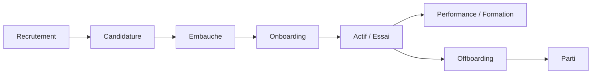

# Cycle de vie employé

## États (`hr_employes.statut`)

| Statut | Description |
|--------|-------------|
| `essai` | Période d'essai en cours |
| `actif` | Employé en poste |
| `suspendu` | Suspension temporaire |
| `inactif` | Inactivité (sans départ formalisé) |
| `parti` | Départ effectif |

## Phases

### 1. Recrutement

- `hr_recrutements` — offre interne
- `hr_candidatures_rh` — pipeline jusqu'à `embauche`
- Conversion → création `hr_employes` (`employe_converti_id`)

### 2. Contrat

- `hr_contrats` — salaire de base, type, dates
- Alimente le moteur de paie (`salaire_base`)

### 3. Onboarding

- `hr_onboarding_taches` — checklist (accès, matériel, formations)

### 4. Vie active

- Présences, congés, performance, discipline (`hr_discipline`)
- Lien profil admin : `profils_administrateurs.employe_id`

### 5. Offboarding

- `hr_departs` — type, date d'effet, checklist JSON
- Archivage employé (`archived_at`)

## Permissions par phase

| Phase | Permission typique |
|-------|-------------------|
| Création employé | `hr.manage_employees` |
| Contrats | `hr.manage_contracts` |
| Recrutement / onboarding | `hr.manage_recruitment` |
| Départ | `hr.manage_offboarding` |

Fichiers : `manage-employee.ts`, migration `20260719_050`.

